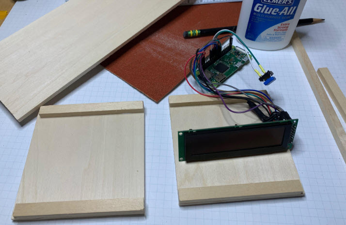
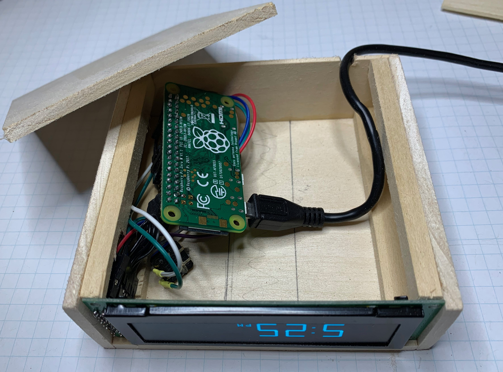
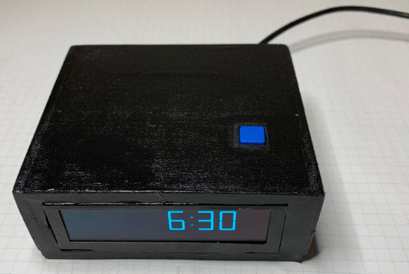

# Clock

A simple clock for the TV room.

Display is from this project: [https://github.com/topherCantrell/ER-OLEDM032-1](https://github.com/topherCantrell/ER-OLEDM032-1)

# Links

https://saelaenx.wordpress.com/2012/10/03/on-the-glcd-fonts/

https://learn.parallax.com/tutorials/language/blocklyprop/oled-display-blocklyprop/installing-oled-fonts

# Parts

# Screen saver

TODO

# Display implementations

  - Large 7 segment
  - Binary
  - Analog
  - Tetris
  - Roman
  - Text
  - Word clock
  - Type font
  
# Construction

