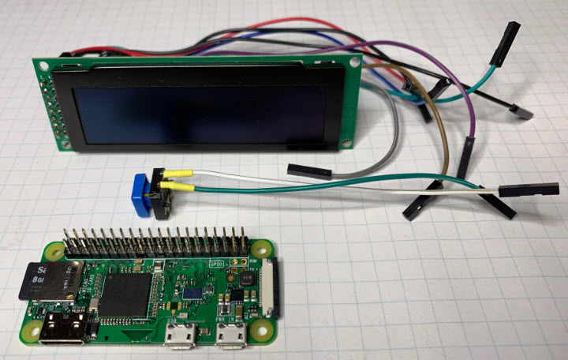

# Clock

A simple clock for the TV room.

Display is from this project: [https://github.com/topherCantrell/ER-OLEDM032-1](https://github.com/topherCantrell/ER-OLEDM032-1)

# Parts

# Screen saver

TODO

# Display implementations

  - Large 7 segment
  - Binary
  - Analog
  - Tetris
  - Roman
  - Text
  - Word clock
  - Type font